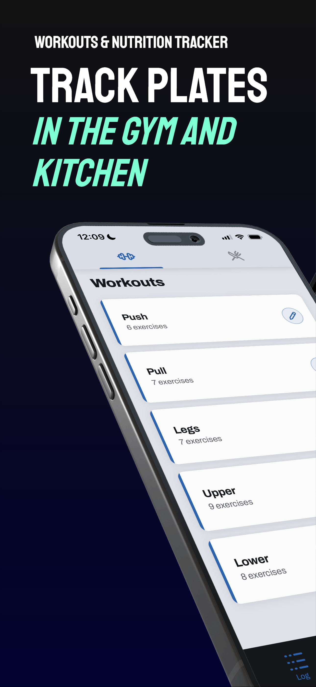
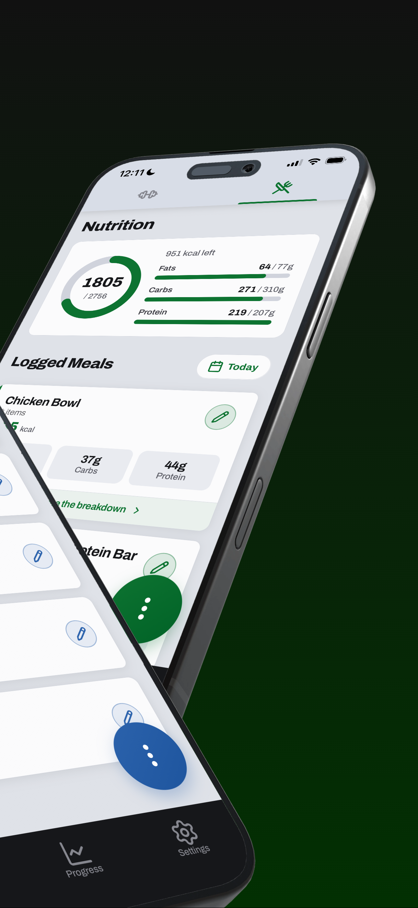
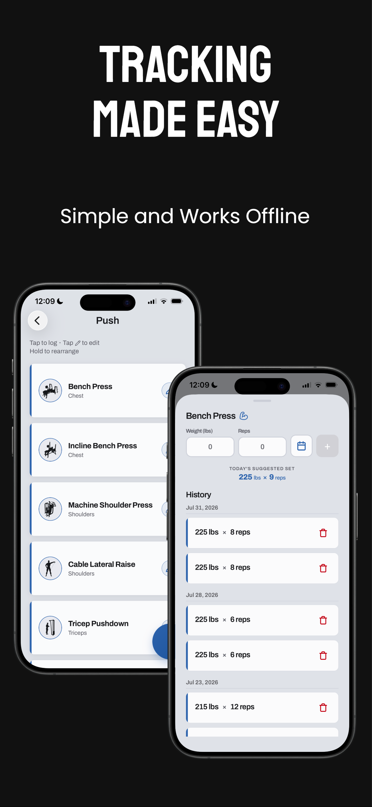
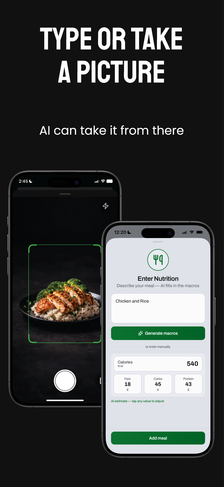
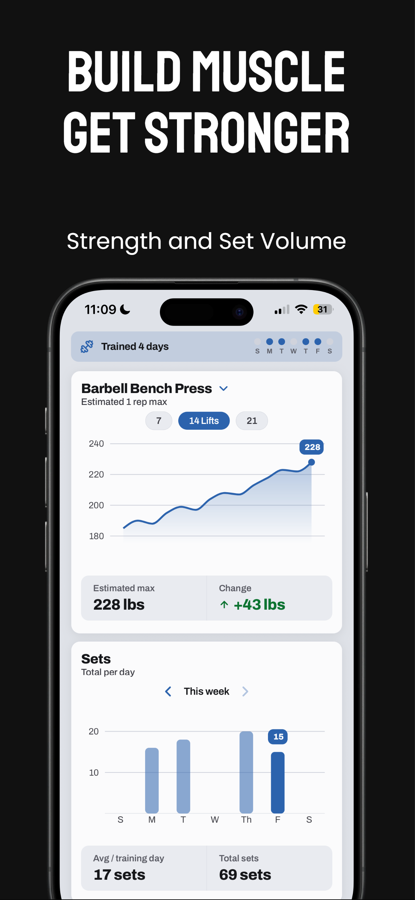
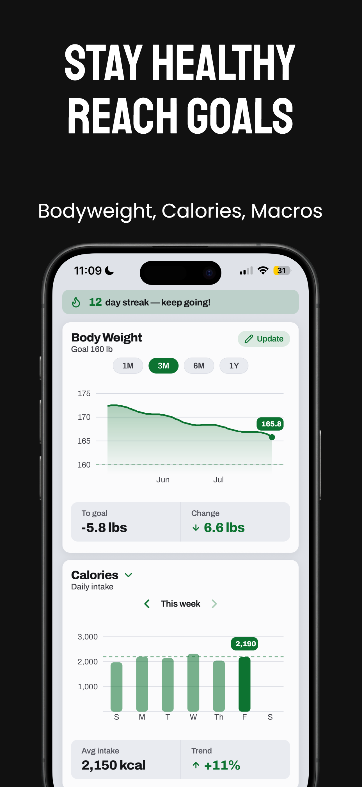

# PLATES

Welcome. This doc gets you from zero to productive: what the app is, what a user can actually
do, the few pieces of logic that are genuinely ours, and how the backend fits together.

---

## What PLATES is

An iOS fitness tracker that does **both halves of the gym** — training and eating — in one app,
instead of making you run a lifting app next to a calorie app.

- **Workout side:** log your sets, and the app tells you what to do next session to beat the
  last one.
- **Nutrition side:** log your food by typing it, photographing it, or searching a food
  database, against calorie and macro targets the app calculated for your goal.
- **Both sides:** charts that show whether any of it is working.

The whole app is **offline-first**. Every read hits a local SQLite database on the phone, and
writes sync up in the background. You can log a full workout in a basement gym with no signal
and nothing blocks or spins.

It's iOS-only right now (Apple Sign-In is the only auth method), free to use for manual
logging, with a **14-day free trial** and then a subscription for the AI and food-database
features.

| | |
|:--:|:--:|
|  |  |
| The **Log** tab in workout mode — your workouts and their exercise counts. | The same tab in nutrition mode — calorie ring, macro bars, and the day's meals. |

---

## The shape of the app

Three tabs. The first two flip between **workout mode** and **nutrition mode** via a switcher
at the top — that toggle is the main navigation idea in the app.

| Tab | Workout mode | Nutrition mode |
|---|---|---|
| **Log** | Your workouts and their exercises | The day's food entries and macro rings |
| **Progress** | Strength charts | Body weight and macro charts |
| **Settings** | Profile, goals, subscription, notifications, support | |

> Heads-up: `mode` is in-memory `useState`, **not persisted** — the app always cold-launches
> into workout mode.

---

## User-facing features

### Onboarding

Nine screens: goals → obstacles → activity → goal → aboutYou → pace → plan → projection →
paywall. It collects age, gender, height, weight, activity level, goal type (lose/gain/
maintain), goal weight, and desired pace, then computes the user's calorie and macro targets
and shows a projection before asking for money.

*Unique logic:* **a maintain goal skips the pace screen**, since there's no pace to pick — so
step numbering can't be hardcoded. [lib/utils/onboardingSteps.ts](lib/utils/onboardingSteps.ts)
does the skip-aware counting. Onboarding is only marked complete on the **paywall**, including
when the user taps "Maybe later" — so bailing on the purchase still lets them into the app.

### Workout mode

- **Workouts → exercises → sets.** Create workouts, add exercises to them, log sets
  (weight × reps, optional RPE).
- **Drag-to-reorder** workouts and exercises. *Not* sets — those are chronological, and can be
  deleted but not edited.
- **Duplicate a workout**, archive/unarchive workouts and exercises, and one autosaved free-text
  note per workout.
- **1,317-exercise library** across nine muscle groups, each with an illustration, a main muscle,
  equipment, and a compound flag. Users can also create custom exercises (no illustration).
- **Progressive-overload suggestions** — the headline feature, shown right under the weight and
  reps inputs on the log sheet.

#### How progressive overload works

The framing is *"beat last session,"* not coaching. Briefly:

1. **The bar is a real set the user performed** — never a synthesized number. The app looks at
   prior sessions for that exercise (today's own sets don't count), within a 14-day window.
2. **The suggestion is one rep more.** At the top of the rep range (12), the weight goes up
   instead and reps reset down.
3. **Weight jumps are sized by how heavy the lift already is**, not by exercise type: +2.5 lb
   under 25 lb and +5 above; +2 kg under 20 kg and +2.5 above. That names a number the gym can
   actually make — a plate-pair or the next dumbbell — where compound-vs-isolation would ask for
   half-plates and 32.5 lb dumbbells that don't exist.
4. **One bad session doesn't lower the bar; two in a row does.** An "off day" has to be both
   lighter *and* lower-scoring than the session before it, so a lighter-but-stronger session
   (185×10 after 190×7) correctly counts as progress.
5. **Sets under 3 reps don't anchor.** A grindy single is a max test, not training volume, and
   would otherwise prescribe a max double next session.
6. **Nothing is persisted.** It's recomputed from log history every time, so editing or
   back-filling a log recalculates cleanly and no stored goal can drift from reality.



The log sheet on the right is rule 2 in the wild: last session was 225 × 8, so today's
suggestion is **225 × 9** — one more rep at the same weight, with the full set history
underneath it.

There's a matching grader that decides whether the set you just logged beat the bar, with four
ways to pass — it credits a heavier bar at one rep fewer, because estimated-max math scores
200×7 as 0.13% short of 195×8 and no human perceives that as a failure.

Code: [progressionFunctions.ts](context/WorkoutContext/functions/progressionFunctions.ts). This
is the churniest logic in the repo — treat it as evolving.

### Nutrition mode

Four ways to log. **Only manual entry is free**; the other three are Pro:

| Path | Pro? | What it does |
|---|---|---|
| Manual | free | Type a name and the macros |
| **AI text** | Pro | Describe a meal in plain text — "2 eggs, toast, orange juice" — and the model fills in the macros |
| **Camera** | Pro | Photograph the food (see the two scan modes below) |
| **Food database** | Pro | Search FatSecret for real per-serving data |
| Saved meals | free | Re-log anything you've saved |



The two AI paths: point the camera at the plate, or describe the meal and tap **Generate
macros**. Either way the result lands in the same editable fields — every AI number is a
starting point the user can tap and change before saving.

**Two camera scan modes**, picked by the user in a segmented control:
- `meal` — any food photo: a plated meal or a packaged/branded product
- `label` — read the printed Nutrition Facts panel directly

Meal and item used to be separate tabs sending the same prompt, differing only in image
handling. Making the user choose was a silent failure mode — a product shot on the default
tab came through smaller and softer — so they merged into one Food tab. The edge function
still accepts `item` as an alias of `meal` for app builds already in the wild.

*Note:* a branded item's macros come straight from the vision model's own reading, same as
everything else it detects — nothing cross-checks it against a database. An earlier version
re-queried FatSecret by brand and overwrote the model's numbers with whichever branded result
ranked first, with no check it was actually the same product; that could silently replace a
correctly-read label value with a different item's macros, so it was removed rather than
repaired. Manual food-database search (the **Food database** row above) is untouched.

Also: **per-item editing** of any logged or AI-detected meal (edit each item's name, brand,
servings, and all four macros; add and delete items, totals recompute), and **combining** staged
items into one named meal.

#### How calorie and macro targets are calculated

Mifflin-St Jeor BMR × an activity factor gives maintenance calories. Goal pace converts to a
daily adjustment (500 kcal/day ≈ 1 lb/week), and the resulting target is split into macros by
goal-type presets (a cut is 30/30/40 protein/fat/carbs; maintain 25/30/45; a bulk 25/25/50).

*Unique logic:* **targets are never silently clamped.** An aggressive pace produces the number
it produces, and the app *warns* about it at the surface — rather than the slider quietly
refusing to move, which reads as a bug. The only floor is a 1 kcal fence so nothing divides by
zero. A `maintain` goal anchors to goal weight rather than current weight, so daily weigh-ins
don't jiggle a maintainer's targets.

Code: [macroCalculation.tsx](context/SettingsContext/functions/macroCalculation.tsx).

### Progress and charts

Two cards per mode, both Skia-rendered via `victory-native`:

| | Top card (line) | Bottom card (bars) |
|---|---|---|
| Workout | Estimated 1RM for a chosen exercise, last **7 / 14 / 21 logged lifts** | Sets per day, one week at a time |
| Nutrition | Body weight over **1M / 3M / 6M / 1Y** with a goal line | Calories / protein / carbs / fats by week |

| | |
|:--:|:--:|
|  |  |
| Workout mode — estimated 1RM over the last 14 lifts, sets per day, and the trained-days banner. | Nutrition mode — body weight against the goal line, daily calories, and the streak banner. |

> The marketing header on the first shot reads "Set Volume," but the chart underneath counts
> **sets**, not volume — see [Not actually surfaced](#not-actually-surfaced).

- **Scrub any chart** — press and drag to get a guideline, a tracking dot, and a readout pill
  with the exact value.
- **Stat chips** under each chart: *Estimated max*, *Total sets*, *Avg / training day*,
  *Avg intake*, *Change*, *To goal*, *Trend*. On-target reads green; **off-target is neutral,
  never red** — an intentional deficit shouldn't look like a mistake.
- **Long ranges stay readable** via endpoint-preserving downsampling — oldest and newest points
  stay raw, the middle compresses into buckets.
- **Animated calorie/macro ring** on the daily intake card, counting up on the UI thread.
- **Activity banner** — trained-days dots for the week, or the nutrition streak flame.

### Weight, goals, and reminders

- **Weigh-ins** with a body-weight chart and a goal line.
- **Goal projection** — weeks-to-goal and a target date. Note this appears in *onboarding and
  the adjust-nutrition wizard only*, not on the Progress tab.
- **Goal-reached flow** — a qualifying weigh-in raises an app-wide prompt (rendered outside the
  router, so it can appear anywhere) offering switch-to-maintenance, set a new goal, or keep
  going.
- **Adjust wizards** — `adjustTraining` and `adjustNutrition1–4` let users redo the core
  onboarding decision later.
- **Three kinds of local notification**: meal reminders (only for meals not yet logged),
  streak nudges (from a 3-day streak), and re-engagement check-ins (after 3 quiet days).
  Scheduled 7 days out as one-shot triggers, kept within iOS's 64-notification budget, and
  suppressed while the app is foregrounded.
- **Calendar navigation** — view and back-log to any past date in either mode.

### Settings and account

Profile editing, subscription management, notification prefs, support requests, "How Nutrition is
Calculated" and "How Graphs Work" explainers, terms/privacy, **live sync status** ("Syncing 3
changes…" / "Everything is up to date!"), and account deletion.

Theming follows the OS by default with a manual light/dark toggle — but **the toggle is one-way**:
once tapped there's no UI path back to `system`.

### Not actually surfaced

Two complete, tested engines have **zero production call sites** — don't assume they're live:
a **fatigue model** (`fatigueFunctions.tsx`) and **training volume** (`getVolumeData`). The
Progress tab charts set counts, not volume, and no screen shows a fatigue number.

---

## Tech stack

Expo SDK 54 · React Native 0.81 · TypeScript strict · Expo Router 6 (file-based routes) ·
Reanimated 4 · victory-native + Skia · Jest + jest-expo · Sentry.

Bundle id `com.LiftTrition.App`. **There are no `ios/` or `android/` folders** — never run
`pod install` or Gradle. Native builds happen on EAS.

### PowerSync — the offline-first layer

This is the piece that shapes everything else, so understand it first.

```
UI  →  local SQLite (PowerSync)  ⇄  Supabase Postgres
       ↑ every read              ↑ background sync, both directions
```

- **Reads never touch the network.** The app queries its own on-device SQLite database. That's
  why it works offline and why nothing shows a loading spinner mid-workout.
- **Writes go to local SQLite first**, land in a CRUD queue, and PowerSync's `Connector` drains
  that queue up to Supabase when there's a connection.
- **The schema is declared twice** — [AppSchema.ts](lib/powersync/AppSchema.ts) for the local
  DB and a Supabase migration for Postgres. Adding a column means both, plus the
  `powersyncStore.ts` mapping.
- **Sync rules** (which rows a user gets) live in the **PowerSync Cloud dashboard**.
  [sync-rules.yaml](lib/powersync/sync-rules.yaml) in the repo is a reference copy only.
- **Adding a column needs a backfill.** Queries are `SELECT *`, so no sync-rules change is
  needed, but existing rows won't carry the new column until they're UPDATEd.
- **Sign-out flushes pending uploads first.** If the flush fails the user gets an explicit
  confirmation rather than silent data loss — don't swallow those errors.

Ten synced tables: `settings`, `workouts`, `exercises`, `logs`, `user_exercises`,
`weight_progress`, `nutrition_entries`, `saved_nutrition_entries`, and the two ingredient
child tables.

### Supabase — database, auth, and server code

**Postgres** is the source of truth that PowerSync syncs against.

**Row Level Security** is on for thirteen tables. Six user-data tables scope directly on
`auth.uid() = user_id`. Four child tables (the two ingredient tables, `exercises`, `logs`) have
no `user_id` column and are scoped by `EXISTS` against their owning parent — `logs` through two
hops. `ai_usage` and `user_entitlements` have RLS with *no* policies (service-role only), and
`support_requests` is insert-only.

**Auth** is Apple Sign-In only. The Supabase session is persisted in
[secureStorage.ts](lib/supabase/secureStorage.ts) (expo-secure-store), and PowerSync
authenticates to its own service using that same Supabase access token.

**Four Edge Functions** in [lib/supabase/functions/](lib/supabase/functions/) hold everything
that needs a secret:

| Function | Does |
|---|---|
| `fetchOpenAI` | Vision + text nutrition estimation via OpenAI |
| `fetchFoodDB` | FatSecret food search and lookup |
| `deleteAccount` | Cascading account + data deletion |
| `revenuecatWebhook` | Mirrors subscription state into `user_entitlements` |

**Why it matters:** no third-party *secret* ever ships in the app bundle. `OPENAI_API_KEY`,
`FATSECRET_*`, `REVENUECAT_SECRET_API_KEY` and the service-role key are
`Deno.env` reads inside these functions only. The client only carries the Supabase anon key and
the RevenueCat *public* SDK key, both designed for distribution.

**Quotas:** per-user daily caps on AI and food-search calls, metered by one atomic SQL function
(`consume_ai_quota`) so there's no check-then-use race. Caps are env-configured per function;
the day boundary is UTC.

### RevenueCat — subscriptions

Entitlement id is `LiftTrition Pro`. Monthly and annual packages, with the annual savings
percentage computed from the two live prices rather than hardcoded. 14-day free trial.

The important design point: **premium is enforced on the server, not just in the UI.**

```
client `hasPremium`  →  UX only (which buttons show a paywall)
Edge Function check  →  the real gate
```

Before any paid upstream call, `fetchOpenAI` and `fetchFoodDB` run a shared check
([_shared/entitlement.ts](lib/supabase/functions/_shared/entitlement.ts)). It reads the
`user_entitlements` table that the RevenueCat webhook keeps mirrored, and falls back to
RevenueCat's REST API whenever that row can't prove premium — missing, expired, non-premium, or
older than 24h. Every failure path **fails closed**. A valid Supabase JWT alone is never enough
to spend our OpenAI budget.

### Sentry

`addBreadcrumb` for routine or retryable failures; `captureException` with `tags: { area: … }`
for actionable ones.

---

## Setup

```bash
npm install
cp .env.example .env     # fill in the three required values
npm start                # expo start --tunnel -c
```

Every `EXPO_PUBLIC_*` var is read only through `ENV` in [lib/env.ts](lib/env.ts). Babel inlines
them statically, so each must appear as a literal `process.env.EXPO_PUBLIC_*` expression — never
index `process.env` dynamically, never read it outside that file.

| Variable | Required | If missing |
|---|---|---|
| `EXPO_PUBLIC_SUPABASE_URL`, `_ANON_KEY`, `EXPO_PUBLIC_POWERSYNC_URL` | yes | throws at startup |
| `EXPO_PUBLIC_REVENUECAT_API_KEY_IOS` / `_ANDROID` | no | billing early-returns |
| `EXPO_PUBLIC_SENTRY_DSN` | no | Sentry disables itself |
| `EXPO_PUBLIC_APP_ENV` | no | falls back to `__DEV__` |

### Commands

```bash
npm start                 # expo start --tunnel -c
npm run ios / android / web

npm run test:ci           # single run — use this for verification
npm test                  # jest --watchAll (watch mode)
npx jest -t "name"        # one test
npm run typecheck         # tsc --noEmit

node scripts/generateImageMap.js                   # regen imageMap.ts after adding PNGs

eas build --platform ios --profile development|preview|production
npm run update-dev | update-preview | update-production        # OTA
```

**OTA caveat:** `runtimeVersion.policy` is `appVersion`, so an update only reaches binaries built
from the same version. Adding a native dependency needs a new binary, not an update push.

---

## Repo layout

```
app/                    Expo Router screens (file = route)
  (tabs)/               index (log), progress, settings
  authScreens/          login
  onboardingScreens/    the nine-screen flow
  nutritionScreens/     add, saved, foodDB, camera, analyzing, editEntry, updateBW
  workoutScreens/       addWorkout, exercises, addExercise, logs, notes, rename, archive
  settingsScreens/      profile, subscription, adjustTraining, adjustNutrition/1–4, …
  devTest/              __DEV__-only routes (see below)

components/
  GraphComponents/      Graph1, BarChart, chartPrimitives, GraphStats, ProgressWheel,
                        ChartReadoutPill, ActivityBanner, SelectionModal
  GuardComponents/      AppLoadingScreen, PowerSyncGuard, SyncWatchdog
  NeutralComponents/    ModeSwitcher, Fab, Calendar, DateSheet, shared primitives
  NutritionComponents/ · WorkoutComponents/ · devTest/

context/                one folder per provider; hooks re-exported from index.tsx
  <Domain>/database/    powersyncStore.ts — all SQL and row↔domain mapping
  <Domain>/functions/   domain logic
  Auth · Billing · Nutrition · Settings · Theme · Workout

lib/
  powersync/            AppSchema, Connector, orchestrator, FlushUploads, persistErrors
  supabase/             client, secureStorage, Edge Functions, SQL migrations
  openAI/ · foodDB/     external calls, via Edge Functions
  notifications/        builders, permissions, prefs, scheduler
  utils/ · hooks/ · devtools/ · env.ts
```

**Size:** ~27k lines of shipping source across 199 files, plus ~27k lines of `__DEV__`-only code
and ~18k lines of tests.

---

## Conventions

- **Comments** — one line above every named function and every non-obvious block; skip inline
  arrow callbacks. Comments cite code only: a file, a symbol, a behaviour. Never a doc or ticket.
- **Logic placement** — a function that doesn't return UI never lives in a screen or component
  file. Domain logic goes in `context/<Domain>/functions/`; anything two or more contexts would
  import goes in `lib/utils`.
- **Data access** — all SQL and row↔domain mapping lives in
  `context/<Domain>/database/powersyncStore.ts`. Adding a field means that file, `AppSchema.ts`,
  and a Supabase migration — not the screen.
- **Styling** — never hardcode a color, font, or radius. Pull `useColors()`, `fonts`/`type`, and
  `radius`/`spacing`/`motion`/`macroColors` from `@/context/ThemeContext`. Static styles use
  `StyleSheet.create()`; theme-reactive ones use `makeStyles(colors)` + `useMemo`.
- **Screen padding** — use `useScreenTopPad` / `useScreenBottomPad`, not raw insets.
- **Navigation** — modals use `presentation: 'modal'`; pushed screens use the native back
  chevron. Don't add custom `headerLeft` buttons — iOS 26 Liquid Glass mis-centers custom JS
  views.
- **Version control is owned by the user.** Don't commit, branch, push, or open PRs unasked.

---

## Testing

**1,188 tests across 102 suites.** Two rules do most of the work:

- **Test cases come before implementation.** If it isn't clear what cases a request calls for,
  stop and ask — never invent filler to fill a quota.
- **Never derive an expectation by running the function.** That turns a bug into a specification.

Coverage is set by the *kind* of logic rather than a fixed count — business rules get a full
scenario matrix; formulas, validation, state, persistence and presentation each have their own
bar. [tests/README.md](tests/README.md) has the protocols and defines fourteen documentation
areas, of which **five are written** so far.

CI runs typecheck as a **blocking** gate, tests as advisory, plus CodeQL.

---

## Dev tooling

`app/devTest/` (51 routes) plus `components/devTest/` is **half the non-test source here**, and
it holds parallel implementations of live screens — so grep results are routinely ambiguous:

- `paceWizard/` — a full duplicate of `adjustNutrition1–4` on a *different* formula.
  **`adjustNutrition1` matches two files; the one under `app/` is real.**
- `onboarding/versions/` — alternative designs for nearly every onboarding screen.
- Chart labs, Dynamic Type and contrast harnesses, mockup scenes, goal-reached simulation.

Entry point is the Dev Hub (`devTest/index`). `lib/devtools/` has `forceLoadFailure`,
`forceSaveFailure` and `forceFreeMode` for exercising retry, error and free-tier paths.

---

## Known open issues

- **No `NSCameraUsageDescription`** and no `expo-camera` config plugin in [app.json](app.json),
  yet the camera screen uses `expo-camera`. iOS has no usage string for the permission prompt.
- **`@shopify/react-native-skia` is imported but not declared.** Three chart files import it;
  it resolves only as a transitive peer of `victory-native`. Every chart breaks if that
  resolution changes. Should be a direct dependency.
- **Hardcoded `★★★★★ 5.0`** with no review count or source on the login, paywall, and
  subscription screens.
- `components/OnboardingComponents/` and `components/WorkoutLogs/` are empty directories.
- `audits/` holds a dated (2026-07-21) 61-issue snapshot. Statuses have drifted both ways —
  re-verify before trusting an entry.
