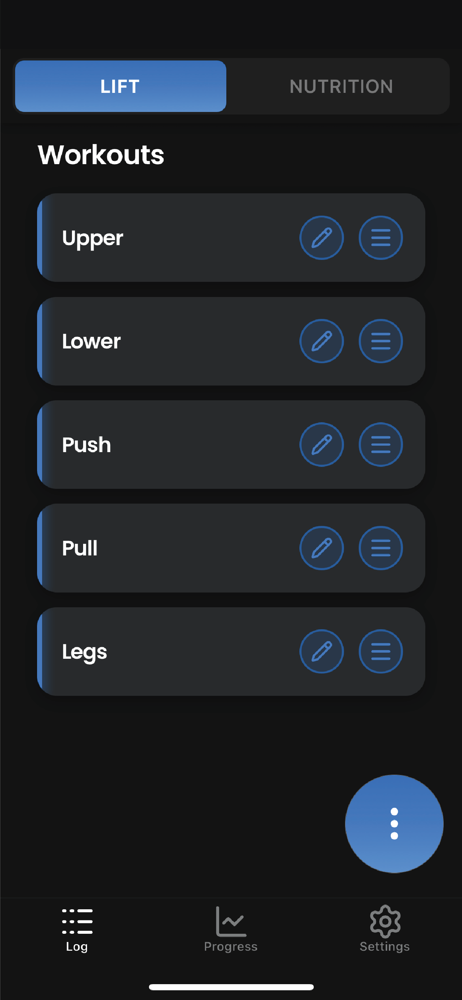
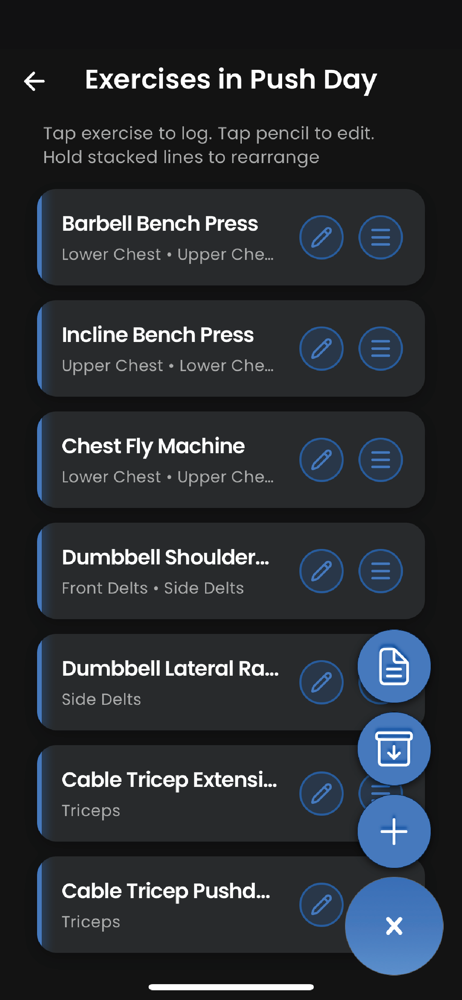
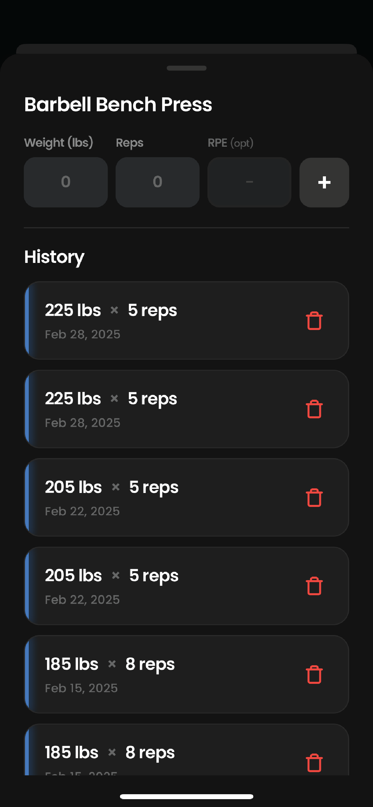
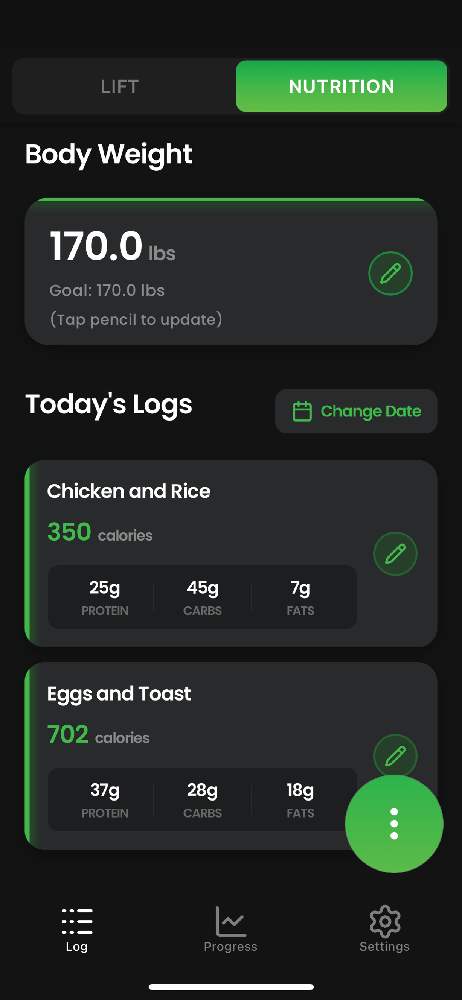
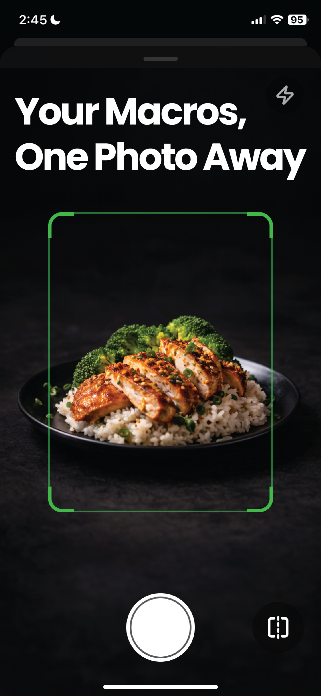
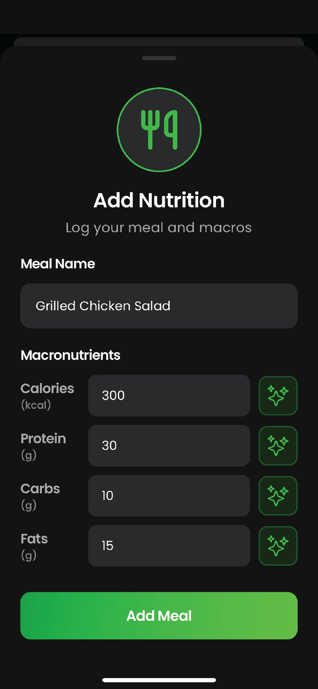
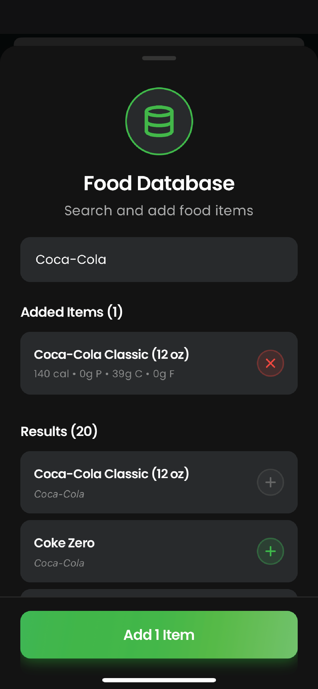
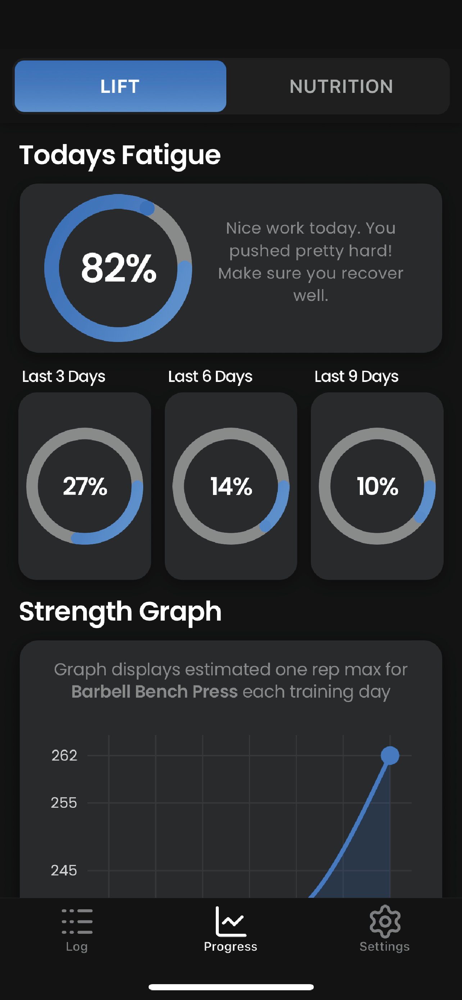
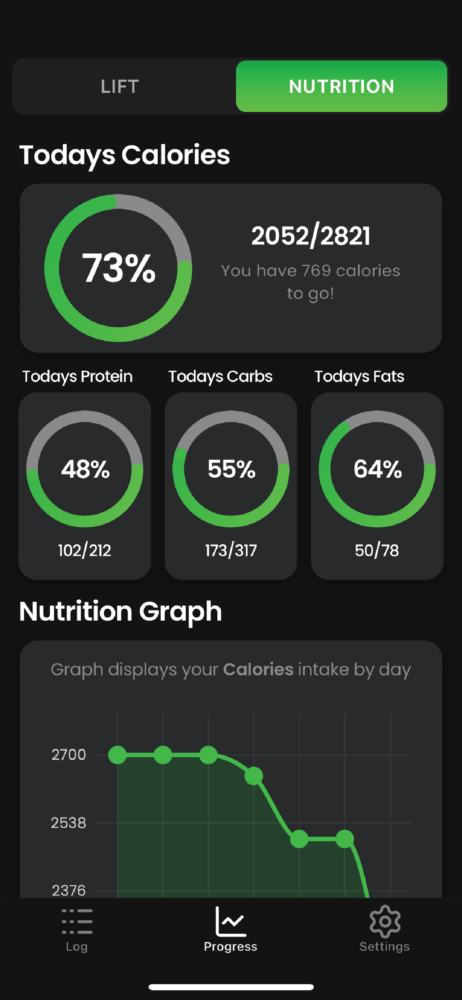

# LiftTrition

Project description: AI powered tracking + progress visualizations for both weightlifting and nutrition in one interface.

In this README, weightlifting mode may be referred to as lift mode or lifting mode.

## Preview

<table>
<tr>
<td align="center" valign="top"><strong>Workouts</strong> </td>
<td align="center" valign="top"><strong>Exercises</strong> </td>
<td align="center" valign="top"><strong>Logs</strong> </td>
</tr>
</table>

<table>
<tr>
<td align="center" valign="top"><strong>Nutrition</strong> </td>
<td align="center" valign="top"><strong>AI photo entry</strong> </td>
<td align="center" valign="top"><strong>Manual nutrition entry</strong> </td>
</tr>
</table>

<table>
<tr>
<td align="center" valign="top"><strong>Food database</strong> </td>
<td align="center" valign="top"><strong>Workout graphs</strong> </td>
<td align="center" valign="top"><strong>Nutrition graphs</strong> </td>
</tr>
</table>

## Tech stack

- **Frontend:** React Native
- **Backend/Database:** Supabase + PowerSync
- **AI API:** OpenAI
- **Food Database API:** FatSecret
- **Subscription / purchases API:** RevenueCat

## Notable / key features

### Interface

- Dual-mode interface for lifting and nutrition tracking and progress visualizations.
- Smooth transitions upon switching modes (between the lift and nutrition interfaces).
- Instant UX using PowerSync for eventual / background syncing.

### Tracking

- **Lift mode** tracking flow: Create workout → Add exercises → Enter exercise logs.
- Workouts and exercises can be archived and have notes added to them.
- Basic and advanced CRUD features for workouts, exercises, and exercise logs.
- **Nutrition mode** tracking flow: Nutrition logs can be added directly using a variety of tools.
- _Assisted manual entry:_ Manually add nutrition logs with help (if needed) from AI to generate macros based on a meal description.
- _Photo entry:_ Snap a picture of your meal and have AI automatically estimate macros from the image. Advanced editing is available for photo entries.
- _Food database:_ Search an extensive food database for branded items with provided macronutrient information.
- Basic and advanced CRUD features for nutrition entries.

### Goals and Progress Graphs

- Automated macro goal calculations using the _Mifflin–St Jeor equation_.
- Estimated fatigue progress wheels using an _adjusted version of Epley’s equation_.
- Calorie and macronutrient progress wheels.
- One-rep max history line graph (derived using _Epley’s equation_).
- Set volume history line graph.
- Calorie and macronutrient intake history line graphs.
- Bodyweight history line graph.
